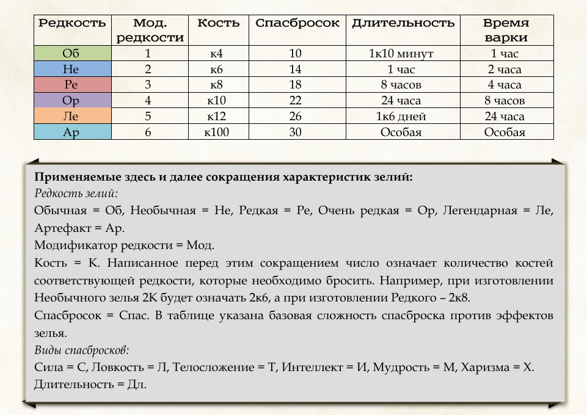
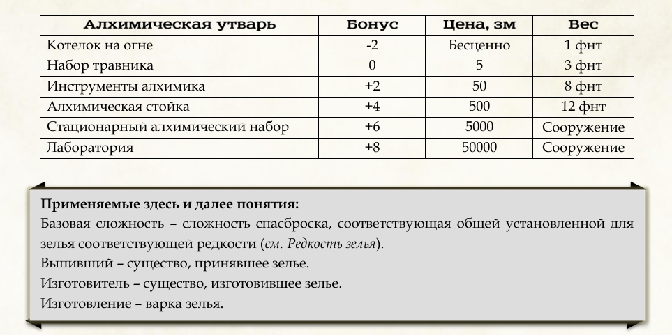

1. TOC
{:toc}

# Что варить?
Каждое зелье состоит из Базы и Ингредиентов. База определяет редкость
зелья, Ингредиенты – его эффект.  
Всего Баз 5 – по одной для зелий каждой редкости, кроме Артефактов.
Ингредиенты также различаются по редкости, но их самих великое
множество. Каждый Ингредиент несѐт в себе один из элементов, из которых
и составляются зелья.
Всего есть четыре вида элементов:
- **Вид существа** – обычно содержится в частях существ и может быть добыт
искателями приключений из поверженных ими противников.
- **Стихия** – элементальная субстанция, тождественная одному из типов урона.
- **Сущность** – остаточная энергия одного из восьми Первичных Созидателей, составляющих всѐ сущее в этом мире: Время, Материя, Разложение, Разум, Остановка, Пространство, Хаос и Энергия.
- **Школа** – эфирное плетение, содержащее в себе силу одной из восьми ветвей
магии.

# Редкость Зелья
Редкость зелья во многом определяет его силу. Зелья определѐнной редкости
имеют базовые значения основных характеристик эффектов, согласно
«Таблице редкости»:

Изготавливая зелье, вы сами определяете его редкость, используя
соответствующую Базу и Ингредиенты. При этом с увеличением редкости
сила зелья также растѐт. Возьмѐм для примера Зелье льда:

| **Зелье Льда** | Мгновенно превращает воду в лѐд в радиусе Мод×5 фт, существа в области совершают спас Л или Опутаны до конца своего следующего хода |

При изготовлении Об Зелья льда радиус эффекта будет равен 1×5 = 5 фт.
Существа, попавшие под действие эффекта, будут должны совершить
спасбросок Л со сложностью 10. Однако если сварить Ре Зелье льда, его
радиус будет уже 15 фт, а сложность спасброска возрастѐт до 18. Избежать
такого эффекта будет крайне непростой задачей для ваших врагов!

# Как варить?

Каждое зелье имеет рецепт, состоящий из Базы и не менее двух элементов,
обычно относящихся к разным видам. Чтобы сварить зелье, необходимо
иметь Базу, Ингредиенты с соответствующими элементами, а также утварь
для варки:

Ингредиенты могут различаться между собой по редкости, но их
минимальная редкость не должна быть ниже редкости Базы.  
Для изготовления зелья необходимо совершить проверку имеющегося у вас
набора Алхимической утвари. При этом существо, имеющее владение
инструментами алхимика считается также владеющим алхимической
стойкой, Стационарным набором и Лабораторией. Сложность проверки
определяется по следующей формуле:

Сложность = 5 × Модификатор редкости + 5 + количество Ингредиентов

Изготовление зелий является лѐгкой активностью и может совершаться в
течение короткого или продолжительного отдыха. Длительность создания
зелья зависит от его редкости, согласно колонке «Время варки» Таблицы
Редкости.
При успехе зелье удаѐтся, изготовитель теряет соответствующие
Ингредиенты и Базу, получая одну порцию зелья.

Если готовка провалится, во время изготовления что-то идѐт не так.
Изготовитель должен совершить бросок к100 по таблице «Изъянов
приготовления» для определения последствий неудачи:

| 1-10 | неизвестно |
| 11-20 | неизвестно |
| 21-30 | неизвестно |
| 31-40 | неизвестно |
| 41-50 | неизвестно |
| 51-100 | неизвестно |

Эффект Изъянов считается эффектом зелья и оканчивается одновременно с
окончанием действия зелья.
Если вы используете опциональное правило критующих навыков, то можете
также использовать таблицу «Исключительной алхимии» для определения
эффекта критического успеха проверки изготовления:

| 1-10 | неизвестно |
| 11-20 | неизвестно |
| 21-30 | неизвестно |
| 31-40 | неизвестно |
| 41-50 | неизвестно |
| 51-100 | неизвестно |

# Виды зелий

Варево бывает трѐх видов: зелья, масла и эликсиры.  
**Масло** – зелье, которое необходимо нанести на предмет или существо, чтобы
оно возымело эффект. По общему правилу требуется 10 минут для
нанесения одной порции зелья на существо Среднего или меньшего размера
и одно действие для нанесения одной порции на одно оружие или три
боеприпаса.  
**Эликсир** – зелье, имеющее эффект заклинания. Эффект такого зелья
считается эффектом заклинания, его целью всегда считается выпивший.
Если заклинание, чей эффект применяется, требует поддержания
концентрации, наложенный эликсиром эффект не требует еѐ. Кроме того,
эффект, наложенный эликсиром, использует Спасбросок в соответствии с
редкостью эликсира вместо сложности спасброска существа. В остальном
эффект заклинания повторяется полностью, если иное не указано в
описании зелья.  
**Зельем** – все остальные варева. Кроме того, это общий собирательный термин для всех видов изготавливаемых алхимически предметов.  
Кроме этого, зелья делятся на Высокие, Общие и Низкие. 
К **Низким** относятся зелья, в составе которых нет Сущностей и Школ.
Эффекты таких зелий не считаются магическими, сами зелья не являются
магическими предметами.  
К **Общим** относятся зелья, в составе которых нет Сущностей, но есть Школы.
Эффекты таких зелий считаются магическими, заклинания, считывающие
магию, такие как «Обнаружение магии», идентифицируют зелья и их
эффекты как эффекты школы магии, входящей в их состав.  
**Высокие зелья** – это зелья, в которых содержатся Сущности. Эти зелья
обладают наиболее мощными эффектами, их воздействие на организм
существа так же губительно, как и эффективно. Существо может безопасно
для себя выпить количество Высоких зелий, равное его модификатору Т.  
При принятии каждого последующего Высокого зелья оно должно
совершить спасбросок Т со сложностью, равной базовой сложности этого
зелья, иначе получит одну степень Истощения.  
Одновременно существо может получать преимущество не более чем от трѐх
Общих и Высоких зелий с длящимся эффектом. Употребление зелья,
дающего четвѐртый длящийся эффект, оканчивает эффект, наложенный
раньше всех.  
При отнесении зелий к одной из этих категорий учитываются только
основные элементы, без примесей.

# Эффекты примесей

Некоторые Ингредиенты, помимо основного элемента содержат в себе
побочный, называемый примесью. В описании Ингредиентов примесь
указывается после основного элемента и отмечена серым цветом. Например,
Глазной стебель Бехолдера содержит основную Сущность «Энергия» и
примесь «Хаос», которые записаны как Э, Х.
Примесь не включается в рецепт зелья, но является его частью и наделяет
варево дополнительным эффектом. Эти эффекты являются частью эффекта
зелья и длятся столько же, сколько и основной эффект, если иное не исходит
из их описания. При присутствии примесей в нескольких Ингредиентах
эффект имеет только старшая примесь. Старшинство определяется
следующим образом:

| Эффекты Сущностей > Школы > Стихии > Вида существа |

Примеси не отменяют действие эффектов Изъянов приготовления и Исключительной алхимии. Ниже представлены эффекты всех примесей.

## Сущности:

| Время | неизвестно |
| Материя | неизвестно |
| Разложение | неизвестно |
| Разум | неизвестно |
| Остановка | неизвестно |
| Пространство | неизвестно |
| Хаос | неизвестно |
| Энергия | неизвестно |

**Школы:**

При употреблении зелья будет наложено случайное заклинание соответствующей примеси школы магии. Выпивший является целью этого заклинания, либо, если заклинание действует по области, оно накладывается с центром на выпившем. Для определения, какое заклинание наложено, выпивший кидает 1К.

|     | Воплощение | Вызов      | Некромантия | Ограждение |
| --- | --------- | --------- | ---------- | --------- |
| 1   | Неизвестно | Неизвестно | Неизвестно  | Неизвестно |
| 2   | Неизвестно | Неизвестно | Неизвестно  | Неизвестно |
| 3   | Неизвестно | Неизвестно | Неизвестно  | Неизвестно |
| 4   | Неизвестно | Неизвестно | Неизвестно  | Неизвестно |
| 5   | Неизвестно | Неизвестно | Неизвестно  | Неизвестно |
| 6   | Неизвестно | Неизвестно | Неизвестно  | Неизвестно |
| 7   | Неизвестно | Неизвестно | Неизвестно  | Неизвестно |
| 8   | Неизвестно | Неизвестно | Неизвестно  | Неизвестно |
| 9   | Неизвестно | Неизвестно | Неизвестно  | Неизвестно |
| 10  | Неизвестно | Неизвестно | Неизвестно  | Неизвестно |
| 11  | Неизвестно | Неизвестно | Неизвестно  | Неизвестно |
| 12  | Неизвестно | Неизвестно | Неизвестно  | Неизвестно |

|     | Иллюзия    | Преобразование | Прорицание | Очарование |
| --- | --------- | ------------- | --------- | --------- |
| 1   | Неизвестно | Неизвестно     | Неизвестно | Неизвестно |
| 2   | Неизвестно | Неизвестно     | Неизвестно | Неизвестно |
| 3   | Неизвестно | Неизвестно     | Неизвестно | Неизвестно |
| 4   | Неизвестно | Неизвестно     | Неизвестно | Неизвестно |
| 5   | Неизвестно | Неизвестно     | Неизвестно | Неизвестно |
| 6   | Неизвестно | Неизвестно     | Неизвестно | Неизвестно |
| 7   | Неизвестно | Неизвестно     | Неизвестно | Неизвестно |
| 8   | Неизвестно | Неизвестно     | Неизвестно | Неизвестно |
| 9   | Неизвестно | Неизвестно     | Неизвестно | Неизвестно |
| 10  | Неизвестно | Неизвестно     | Неизвестно | Неизвестно |
| 11  | Неизвестно | Неизвестно     | Неизвестно | Неизвестно |
| 12  | Неизвестно | Неизвестно     | Неизвестно | Неизвестно |

Если наложенное заклинание требует поддержания концентрации, выпивший считается концентрирующимся на этом заклинании. Если выпивший не может поддерживать концентрацию или уже концентрируется на другом заклинании, оно просто действует до начала следующего хода выпившего, после чего заканчивается.

## Стихии

| Звук | неизвестно |
| Излучение | неизвестно |
| Психический | неизвестно |
| Силовое поле | неизвестно |
| Яд | неизвестно |
| Остальное | неизвестно |

## Виды существ:

Выпивший претерпевает частичную трансформацию:

| Абберация | неизвестно |
| Великан | неизвестно |
| Гуманоид | неизвестно |
| Дракон | неизвестно |
| Зверь | неизвестно |
| Исчадие | неизвестно |
| Конструкт | неизвестно |
| Монстр | неизвестно |
| Небожитель | неизвестно |
| Нежить | неизвестно |
| Растение | неизвестно |
| Слизь | неизвестно |
| Фея | неизвестно |
| Элементаль | неизвестно |

# Преобразование ингридиентов

Некоторые примеси могут значительно усложнять жизнь, потому алхимики разработали способы очищения Ингредиентов от лишних частей:
- **Магическая пыль** – дополнительный Ингредиент, добавление которого в зелье нейтрализует действие старшей примеси. При последующем добавлении будут нейтрализоваться следующие по старшинству примеси.
- **Зелье Равенства и Братства** – при обработке им Ингредиента элемент и примесь меняются местами. Например, если обработать зельем Глазной стебель Бехолдера, он станет Ингредиентом с основной Сущностью «Хаос» и примесью «Энергия». Для обработки одного Ингредиента требуется одна порция Зелья Равенства и Братства любой редкости.
- **Универсальная приманка I** – зелье, при обработке которым Ингредиентов частей существ, заменяет их элементы на Вид существа, соответствующий виду существа, с которого Ингредиент был собран.

# Как собирать ингридиенты

Ингредиенты делятся на четыре категории:
- **Растения** – организмы, отличающиеся автотрофным питанием, основанным на использовании энергии Солнца.
- **Ископаемые** – минералы, камни и прочие неживые природные ресурсы.
- **Существа** – битвы с монстрами приносят не только опыт, но и материалы для алхимии.
- **Иные** – фантазии автора, которые не удалось определить в самостоятельную группу.

*Об*, *Не* и *Ре* Растения, а также некоторые Ингредиенты других категорий, можно найти в природе. Находясь в одном из биомов, персонаж может потратить 1 час на то, чтобы отправиться на поиски Ингредиентов. Для этого Игрок выбирает редкость растений, которые он желает искать, и совершает проверку Природы. Сложность проверки зависит от редкости искомых Ингредиентов:

| Редкость | Сложность |
| -------- | --------- |
| Об       | 12        |
| Не       | 18        |
| Ре       | 18        |

При успехе персонаж совершает бросок по таблице Ингредиентов соответствующего биома. За каждые 5 пунктов, на которые результат проверки превышает еѐ сложность, совершается дополнительный бросок по таблице и получаются дополнительные Ингредиенты.

**Ископаемые** проще всего купить в алхимических или ювелирных лавках, однако есть возможность добыть большую часть Ингредиентов своими руками.

С **Существами** всё предельно просто. Пришел, увидел, победил, забрал все, что смог. Правила добычи частей монстров описаны "тут"(будет позже). Все части существ распределены по редкости, им присвоены элементы в соответствии с их свойствами.

ОСТАЛЬНЫЕ ТАБЛИЦЫ БУДУТ РАСПОЛАГАТЬСЯ ОТДЕЛЬНО И ПОЗЖЕ.
