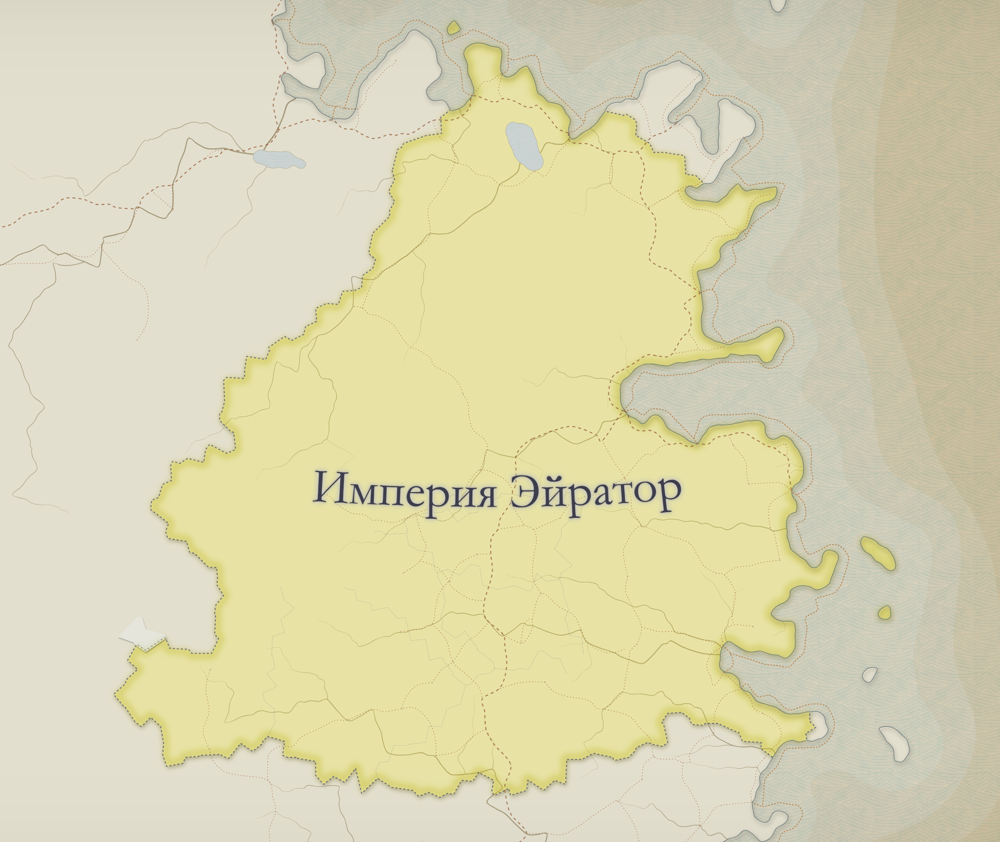

1. TOC
{:toc}

## 🏰 Империя Эйратор

**Основание**: Легендарным героем по имени Эйратор, пережившим катастрофу прошлого и объединившим расколотые земли под своим началом.

**Культ основателя**: Существовал в первые века Империи, но был официально упразднён при императоре Торвене Дель Никсе, ввиду чрезмерной власти жрецов, вмешательства культа в наследование престола и конфликта с реформаторской властью.

## География

## Политический строй

**Диархия** — двуединое правление: император и императрица, брат и сестра, равны по титулу и влиянию.

**Меритократическая система** — ключевые посты занимают талантливые граждане вне зависимости от происхождения и расы.

**Орден Разума и Воли** — структура государственных органов, управляемая светскими и научными лидерами.

**Расовая интеграция** — все разумные расы равноправны в законе, обучении и управлении.

**Реформаторская идеология** — Империя отвергает наследственные привилегии и аристократию прошлого.

## 👑 Действующие правители Империи

### ⚔️ Императрица Лаэрис Вир Никс, Клинок Золотого Пламени
**Титул**: Госпожа Перемен, Меч народа

> «Да воссядет на трон Лаэрис Вир Никс — Клинок Золотого Пламени, сверкающая воля Эйратора, Госпожа Перемен, что сметает застой и страх, и Меч Народа, поднятый в защиту справедливости. Да будет её огонь ясным, её шаг несгибаемым, её правление — закалено истиной.»

### 🧠 Император Аврелий Вир Никс, Голос Непоколебимости
**Титул**: Строитель Эпохи, Ось Империи

> «Да воссядет на трон Аврелий Вир Никс — Голос Непоколебимости, разум имперского строя, Строитель Эпохи, что воздвигает порядок на месте былой тени, и Ось Империи, вокруг которой вращаются судьбы державы. Да будет его слово твёрдым, его мысль ясной, а правление — выточено из камня воли и стали закона.»

## Ночь разорванной короны

> Ровно десять лет назад, Империя Эйратор лишилась опоры своего старого мира. В Императорском дворце произошло преступление, которое навсегда изменило порядок власти. 
Погиб Салюстиан Вир Никс, император, носивший титул Жезла Благородства. С ним пала и Верена Каэриан, Лилия Спокойствия, чья мудрость служила костяком юридической сферы Империи. Их смерть стала не просто трагедией династии — она ознаменовала конец Эпохи Тишины.  
Согласно хронике, нападавшие проникли во дворец при содействии изменников из Совета Институтов, замыслив установить власть старой знати. Но из этой ночи восстали те, кого никто не ожидал увидеть на троне.

> "...Когда мы прорвались через западную галерею, уже было поздно. Тела охраны Императора лежали недвижно. Кровь, словно карамель, застыла на мраморе. Мы ожидали худшее в покоях юных наследников.

>Первой мы достигли зала принцессы. Дверь была полуоткрыта. Запах масла от факела смешивался с чем-то... острым. Внутри — тишина. И пепел. На стене, где раньше висели два фамильных золотых клинка, зияла пустота. Один клинок был у неё в руке. Другой — в теле убитого. Взгляд спокойный, как камень. Без дрожи. Кровь стекала по запястью, но рука не дрожала. Никто не осмелился заговорить первым.

>Потом мы ворвались в покои принца. Стражи, пришедшие с заговорщиками, стояли на коленях, бессильно опустив оружие. Двое плакали. Один просил прощения. Наследник не тронул их. Он просто сидел на краю ложа, глядя в окно, как будто слышал голос чего-то далёкого. А у его ног лежали два бездыханных тела...

>Ту ночь позже назовут Ночью Разорванной Короны — символом крушения иллюзии стабильности, смерти ритуалов без воли, и рождения нового строя. На утро, народ увидел не детей, но правителей.

>Первым же указом сразу после коронации Аврелия было правозглашение нового строя - Диархии, а его сестру - Императрицей. Так, впервые за тысячелетнюю историю Империя Эйратора имела сразу два правителя - Императора и Императрицу, да и еще таких юных - им было всего 15 лет

## Застой десятилетиями

🧭 1. Ставка на равновесие, а не на действия  
Салюстиан верил в концепцию “величественного баланса”, стремясь удерживать старую знать и новые магические школы в хрупком компромиссе.

В реальности это означало отсутствие решительных реформ, застой и расцвет интриг.

🧬 2. Сохранение привилегий старой аристократии  
Под давлением традиционных домов он не лишал старых элит власти, а лишь ограничивал их публичную активность.

Простолюдины, новые расы и представители торговых гильдий чувствовали себя отстранёнными.

🗝️ 3. Невмешательство в дела Совета Институтов  
Имперская бюрократия получала всё больше автономии, а монархия становилась церемониальной.

Народ видел правителей не как лидеров, а как отдалённые символы, «лица без воли».

🕯️ 4. Нехватка харизмы в народе  
Верена была холодной, хотя и уважалась в кругах учёных.

Салюстиан редко появлялся вне дворца, не проводил публичных церемоний, не выступал перед народом.

🔒 5. Подавление радикальных реформаторов  
Молодые маги, идеологи и философы, выступавшие за быструю перестройку, подвергались цензуре и изоляции.

Это вызвало негодование в академиях и среди умных, но простых граждан.

⚖️ 6. Политические изъяны правления  
Заговор возник на фоне двойного разочарования:

- Старая знать была недовольна постепенной утратой влияния (некоторые регионы перешли под управление новых структур).
- Прогрессивные слои — недовольны отсутствием радикальных изменений, обвинили правителей в предательстве идеалов Эйратора.

Покушение стало кульминацией — попыткой установить “истинное руководство”, будь то реакционное или утопическое.
